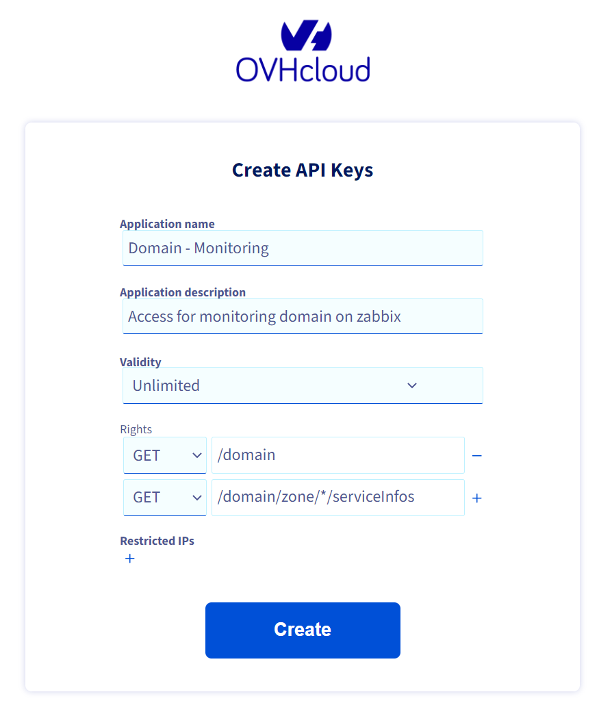
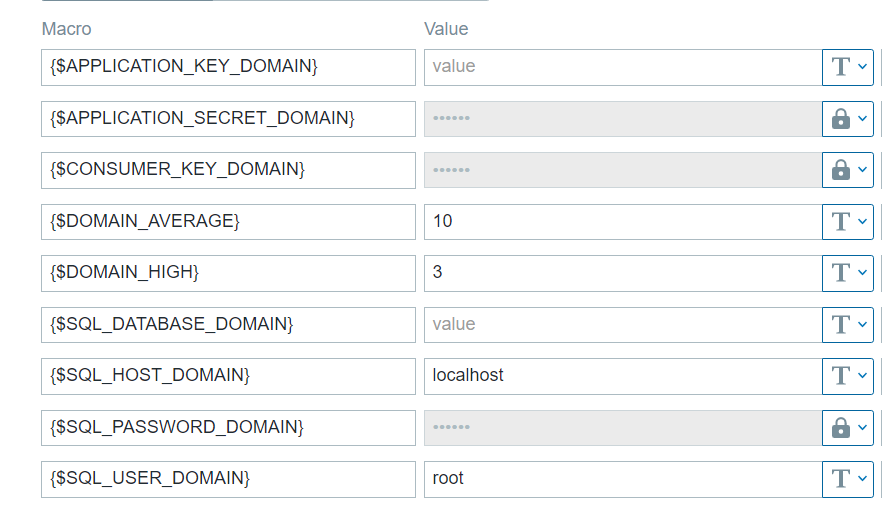

# Domain OVH

- Author : Florian DJERBI
- Object : Monitoring NAS OVH
- Creation Date : 04/26/2023
- Modification Date : 04/28/2023


## Information
- Version Python: 3.7+
- Version: 0.1
- Library: ovh, json, sys


## Installation
Importer le template **ovh-domain_templates.xml** sur votre Zabbix.

### OVH API Token
Il faut tout d'abord créer un Token pour les accès [OVH](https://www.ovh.com/auth/api/createToken).



Vous pouvez aussi restreindre les accès à l'IP du serveur de monitoring.

### Installation Serveur
``` bash
mkdir /etc/zabbix/scripts/ovh-domain
cd /etc/zabbix/scripts/ovh-domain
python3.7 -m venv env
source env/bin/activate
pip install ovh mysql-connector
env/bin/python3.7 domain.py # Test script
```
Copier/Coller les scripts python dans le dossier.

``` conf
#/etc/zabbix/zabbix_agentd.d/userparameter_domain.conf
UserParameter=OVHAPI.DOMAIN[*],cd /etc/zabbix/scripts/ovh-domain && env/bin/python3.7 domain.py $1 $2 $3
UserParameter=OVHAPI.DOMAIN.INFO[*],cd /etc/zabbix/scripts/ovh-domain && env/bin/python3.7 domain_info.py $1 $2 $3 $4
UserParameter=OVHAPI.DOMAIN.SQL[*],cd /etc/zabbix/scripts/ovh-domain && env/bin/python3.7 domain_sql.py $1 $2 $3 $4 $5 $6 $7
```
Changer le chemin si besoin.

### Template Zabbix
Importer le [template sur zabbix](./ovh-domain_templates.xml). Puis ajouter le template sur le serveur de monitoring dans zabbix.

3 Macros sont a renseigner:
 - {$APPLICATION_KEY_DOMAIN}
 - {$APPLICATION_SECRET_DOMAIN}
 - {$CONSUMER_KEY_DOMAIN}

Les valeurs du Token d'accès OVH API.

**Bien penser à mettre en place des actions pour les différentes alertes *(Average, High et Disaster)*!**

### Database SQL
Importer la [table ovh-domain](./table_domain_ovh.sql) sur votre database de votre choix.

4 Macros sont a renseigner:
 - {$SQL_HOST_DOMAIN}
 - {$SQL_USER_DOMAIN}
 - {$SQL_PASSWORD_DOMAIN}
 - {$SQL_DATABASE_DOMAIN}

 Un itme fait la mise à jours des domaines tous les jours.

### Macros
